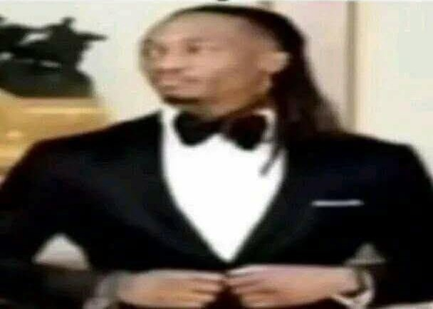

# 
TensorTonic Solutions

  

  <b>from-scratch ML / DL / AI implementations</b> 
  building intuition, one gradient at a time

  
  
  
  

  
  
  

---

## About

This repository contains my personal solutions to problems from [TensorTonic](https://tensortonic.com).

TensorTonic is a platform focused on implementing core Machine Learning and Deep Learning algorithms from scratch.  
This repo is my running archive of those solutions.

---

## Why this repo exists

A lot of people can call the library.

I want to understand the machinery.

So this repository is focused on:
- implementing ML and DL fundamentals manually
- building intuition for optimization, probability, and model behavior
- understanding what actually happens under the hood
- turning theory into code

---

## What I work on here

Topics include:
- Machine Learning
- Deep Learning
- Neural Networks
- Transformers
- NLP
- Computer Vision
- Recommender Systems
- Optimization
- Metrics & Evaluation
- Data Processing
- MLOps

---

## Philosophy

- less black box
- more first principles
- more implementation
- more intuition
- more pain
- more aura

---

## Tech stack

Mostly:
- Python
- NumPy

No heavy abstraction if the point is to understand the algorithm.

---

## Vibe check

  

  <i>debugging gradients with maximum aura</i>

---

## Notes

- These are educational implementations
- Focus is on correctness, clarity, and fundamentals
- Solutions are synchronized from TensorTonic

---

## Disclaimer

This repository contains my own solutions to TensorTonic problems for learning and reference purposes.

Support the original platform here:  
[TensorTonic](https://tensortonic.com)

<!-- tensortonic:start -->
# Accel's TensorTonic Solutions

Verified machine learning implementations completed on [TensorTonic](https://www.tensortonic.com).

  

| Problem | Description | Link |
|---|---|---|
| Implement Adam Optimizer Step | Implement one vectorized Adam optimizer step in NumPy with first and second moments, bias correction, and elementwise parameter updates. | https://www.tensortonic.com/problems/adam-optimizer |
| Anchor Box Generation | Generate object-detection anchor boxes across a feature grid for every scale and aspect-ratio combination. | https://www.tensortonic.com/problems/anchor-box-generation |
| Baseline Predictor | Predict collaborative-filtering ratings from the global mean plus user and item rating biases. | https://www.tensortonic.com/problems/baseline-predictor |
| Batch Shuffling & Mini-Batch Generator | Create shuffled mini-batches from NumPy feature and target arrays with reproducible ordering and final-batch handling. | https://www.tensortonic.com/problems/batch-generator |
| Bigram Probabilities (Add-1 Smoothing) | Estimate bigram probabilities from token sequences using add-one smoothing over a fixed vocabulary. | https://www.tensortonic.com/problems/bigram-probabilities |
| BLEU Score | Calculate a BLEU translation score from candidate and reference tokens using clipped n-gram precision and brevity penalty. | https://www.tensortonic.com/problems/bleu-score |
| Implement BM25 Ranking Score | Implement BM25 document ranking with term frequency saturation, inverse document frequency, and length normalization. | https://www.tensortonic.com/problems/bm25 |
| Implement Causal Masking for Attention | Create a causal attention mask that blocks each token from attending to future positions in a sequence. | https://www.tensortonic.com/problems/causal-masking |
| Chi-Square Test | Run a chi-square independence test on a contingency table using expected counts and the chi-square statistic. | https://www.tensortonic.com/problems/chi2-independence |
| Compute Confusion Matrix with Normalization | Build a multiclass confusion matrix and optionally normalize counts by true-class rows or predicted-class columns. | https://www.tensortonic.com/problems/confusion-matrix-norm |
| Decision Tree Best Split | Find the best decision-tree split by evaluating candidate feature thresholds and selecting the largest impurity reduction. | https://www.tensortonic.com/problems/decision-tree-split |
| Implement Dropout (Training Mode) | Implement training-mode dropout in NumPy with random masking and inverted scaling of retained activations. | https://www.tensortonic.com/problems/dropout-training |
| ETL Dependency Orchestration | Resolve ETL job dependencies into a valid execution order while detecting missing or cyclic dependencies. | https://www.tensortonic.com/problems/etl-dependency-orchestration |
| ETL Schema Validation | Validate ETL records against required field names and data types, reporting rows that violate the schema. | https://www.tensortonic.com/problems/etl-schema-validation |
| Gaussian Naive Bayes | Fit Gaussian Naive Bayes class statistics and predict labels from priors and feature likelihoods. | https://www.tensortonic.com/problems/gaussian-naive-bayes |
| Implement Gradient Descent for a 1D Quadratic | Optimize a one-dimensional quadratic with iterative gradient descent and return the parameter trajectory. | https://www.tensortonic.com/problems/gradient-descent-quadratic |
| Apply 4×4 Homogeneous Transform | Apply a 4x4 homogeneous transformation matrix to 3D points using rotation, translation, and homogeneous coordinates. | https://www.tensortonic.com/problems/homogeneous-transform |
| Impute Missing Values (mean/median) | Impute missing numeric values column-wise with either the mean or median while leaving observed values unchanged. | https://www.tensortonic.com/problems/impute-missing |
| Implement InfoNCE Loss | Compute InfoNCE contrastive loss from query and key embeddings using temperature-scaled similarities. | https://www.tensortonic.com/problems/info-nce-loss |
| Isotonic Regression Calibration | Calibrate prediction scores with isotonic regression while producing a monotonic non-decreasing mapping. | https://www.tensortonic.com/problems/isotonic-calibration |
| Jaccard Similarity | Compute Jaccard similarity between two collections as intersection size divided by union size. | https://www.tensortonic.com/problems/jaccard-similarity |
| K-Means Centroid Update | Update K-means centroids as cluster means while applying the required behavior for empty clusters. | https://www.tensortonic.com/problems/k-means-centroid-update |
| K-Fold Split (Indices Only) | Generate deterministic K-fold train and validation index splits that use every sample exactly once for validation. | https://www.tensortonic.com/problems/kfold-split |
| L-BFGS Two-Loop Recursion | Implement the L-BFGS two-loop recursion to transform a gradient using stored correction-vector history. | https://www.tensortonic.com/problems/lbfgs-two-loop |
| Implement Leaky ReLU (with α) | Apply Leaky ReLU element-wise with a configurable negative slope while retaining positive inputs. | https://www.tensortonic.com/problems/leaky-relu |
| Logistic Regression Training Loop | Train binary logistic regression in NumPy using sigmoid probabilities, gradient descent, and learned weight and bias parameters. | https://www.tensortonic.com/problems/logistic-regression-training |
| Matrix Transpose | Implement matrix transpose in NumPy without built-in transpose helpers, preserving rectangular shapes and the original input. | https://www.tensortonic.com/problems/matrix-transpose |
| Compute Mean Average Precision (mAP) | Compute mean average precision across ranked retrieval results from per-query relevance labels. | https://www.tensortonic.com/problems/mean-average-precision |
| Monitoring Metrics Selection | Compute the required monitoring metrics for classification, regression, or ranking prediction results. | https://www.tensortonic.com/problems/monitoring-metrics-selection |
| Naive Bayes Log-Likelihood (Bernoulli) | Compute Bernoulli Naive Bayes log-likelihoods from binary features, class priors, and feature probabilities. | https://www.tensortonic.com/problems/naive-bayes-bernoulli |
| Pad Sequences | Pad or truncate variable-length token ID sequences in NumPy with configurable maximum length and padding values. | https://www.tensortonic.com/problems/pad-sequences |
| PCA Projection | Project centered observations onto supplied principal components to produce lower-dimensional features. | https://www.tensortonic.com/problems/pca-projection |
| Implement Positional Encoding (sin/cos) | Generate sinusoidal Transformer positional encodings across sequence positions and embedding dimensions. | https://www.tensortonic.com/problems/positional-encoding |
| Retraining Trigger Design | Evaluate production monitoring signals and decide whether they satisfy the configured model-retraining policy. | https://www.tensortonic.com/problems/retraining-trigger-design |
| RMSProp Optimizer (Single Update Step) | Implement one RMSProp update in NumPy using an exponential squared-gradient average and adaptive scaling. | https://www.tensortonic.com/problems/rmsprop-optimizer |
| RNN Step Backward (Vanilla RNN) | Backpropagate through one vanilla RNN timestep to compute input, hidden-state, weight, and bias gradients. | https://www.tensortonic.com/problems/rnn-step-backward |
| Compute ROC Curve from Scores | Construct ROC curve thresholds with corresponding true-positive and false-positive rates from binary scores. | https://www.tensortonic.com/problems/roc-curve |
| ROI Pooling | Pool variable-size regions of interest into fixed spatial output grids using per-bin maximum values. | https://www.tensortonic.com/problems/roi-pooling |
| Implement Sigmoid in NumPy | Implement a vectorized sigmoid activation in NumPy for scalars, lists, vectors, and matrices, including large positive and negative inputs. | https://www.tensortonic.com/problems/sigmoid-numpy |
| Stratified Train/Test Split | Split indices into train and test sets while approximately preserving the class distribution of each label. | https://www.tensortonic.com/problems/stratified-split |
| One-Sample t-Test | Compute a one-sample t-statistic in NumPy using the sample mean, Bessel-corrected deviation, and hypothesized mean. | https://www.tensortonic.com/problems/t-test-one-sample |
| Implement TF-IDF Vectorizer | Build TF-IDF document vectors from token counts and inverse document frequency across a text corpus. | https://www.tensortonic.com/problems/tfidf-vectorizer |
| Fine-tuning Architecture | Build BERT fine-tuning utilities for freezing encoder layers and producing sequence or token classification logits. | https://www.tensortonic.com/research/bert/bert-fine-tuning |
| Masked Language Modeling | Implement BERT masked language modeling with the 80-10-10 replacement strategy, training labels, and vocabulary logits. | https://www.tensortonic.com/research/bert/bert-masked-lm |
| Next Sentence Prediction | Create BERT next-sentence prediction pairs and compute binary classification logits for IsNext and NotNext examples. | https://www.tensortonic.com/research/bert/bert-nsp |
| BERT Pooler | Implement the BERT pooler by projecting the first token's hidden state through a dense layer and tanh activation. | https://www.tensortonic.com/research/bert/bert-pooler |
| Segment Embeddings | Build BERT input embeddings by summing learned token, position, and sentence-segment embedding vectors. | https://www.tensortonic.com/research/bert/bert-segment-embedding |
| WordPiece Tokenization | Implement BERT WordPiece tokenization with greedy longest-match subwords, continuation prefixes, and unknown-token fallback. | https://www.tensortonic.com/research/bert/bert-wordpiece |
| Complete GAN System | Assemble a complete GAN system that generates samples, scores them with the discriminator, and returns both outputs. | https://www.tensortonic.com/research/gan/gan-full-network |
| GAN Training Loop | Implement one GAN training iteration with separate discriminator and generator forward and update steps. | https://www.tensortonic.com/research/gan/gan-training-loop |
| Complete GRU Network | Assemble a GRU sequence forward pass that recurrently updates and returns hidden states across time steps. | https://www.tensortonic.com/research/gru/gru-full-network |
| KDA Recurrence | Implement Kimi K3's KDA recurrence with gated state updates, normalized queries and keys, and ordered token readouts. | https://www.tensortonic.com/research/kimik3/k3-kda-recurrence |
| Complete LSTM Network | Assemble an LSTM sequence forward pass that carries hidden and cell states across every time step. | https://www.tensortonic.com/research/lstm/lstm-full-network |
| Full ResNet Assembly | Assemble a ResNet forward pass from the stem, residual stages, global average pooling, and the classification head. | https://www.tensortonic.com/research/resnet/resnet-full-network |
| Complete Vanilla RNN | Assemble a vanilla RNN that processes sequences into recurrent hidden states and per-time-step output logits. | https://www.tensortonic.com/research/rnn/rnn-full-network |
| Vanishing Gradients | Simulate vanishing or exploding RNN gradients by repeatedly applying the hidden matrix's spectral norm. | https://www.tensortonic.com/research/rnn/rnn-vanishing-gradients |
| Multi-Head Attention | Build NumPy multi-head attention with learned projections, per-head scaled attention, concatenation, and output projection. | https://www.tensortonic.com/research/transformer/transformers-multi-head-attention |
| Complete U-Net Network | Assemble U-Net encoder, bottleneck, decoder, skip-connection, and output stages while tracking valid-convolution shapes. | https://www.tensortonic.com/research/unet/unet-full-network |
| U-Net Skip Connections | Implement U-Net skip connections by center-cropping encoder features and concatenating them with decoder features. | https://www.tensortonic.com/research/unet/unet-skip-connection |
| ELBO Loss Function | Implement the VAE evidence lower bound from reconstruction loss and KL divergence with configurable weighting. | https://www.tensortonic.com/research/vae/vae-elbo-loss |
| Complete VAE Network | Assemble a complete variational autoencoder forward pass with encoding, reparameterized sampling, and decoding. | https://www.tensortonic.com/research/vae/vae-full-network |
| Complete VGG Network | Assemble a complete VGG16 forward pass by composing the configured feature extractor with the classifier head. | https://www.tensortonic.com/research/vgg/vgg-full-network |
| Class Token [CLS] | Prepend a learned classification token to each Vision Transformer patch sequence for image-level prediction. | https://www.tensortonic.com/research/vit/vit-class-token |
| ViT Encoder Block | Build a Vision Transformer encoder block with layer normalization, multi-head attention, MLP, and residual connections. | https://www.tensortonic.com/research/vit/vit-encoder-block |
| Complete Vision Transformer | Assemble a complete Vision Transformer from patch embedding, class and position tokens, encoder blocks, and classifier. | https://www.tensortonic.com/research/vit/vit-full-network |
| Classification Head | Implement the Vision Transformer classification head by normalizing and projecting the final class-token representation. | https://www.tensortonic.com/research/vit/vit-mlp-head |
| Patch Embedding | Implement Vision Transformer patch embeddings by splitting images into fixed patches and linearly projecting each patch. | https://www.tensortonic.com/research/vit/vit-patch-embedding |
| Position Embedding | Add learned positional embeddings to Vision Transformer patch-token sequences while preserving batch dimensions. | https://www.tensortonic.com/research/vit/vit-position-embedding |

View my verified ML profile: [TensorTonic profile](https://www.tensortonic.com/profile/accelra)
<!-- tensortonic:end -->
